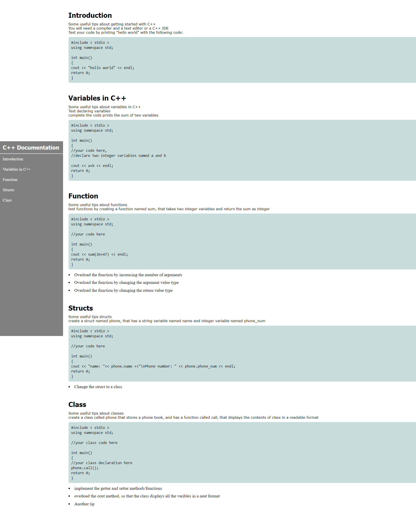

# Technical-Documentation-Page
 A simple technical documentation page for FreeCodeCamp certification project.

 I used c++ basic functions to make this documentation to complete the project.

 ## Preview
 
